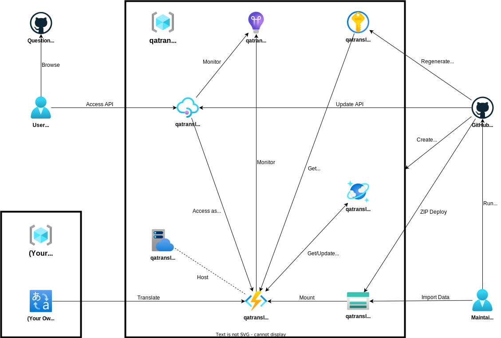

# QuestionAnswerTranslator

[](https://github.com/infhyroyage/QuestionAnswerTranslator/actions/workflows/create-azure-resources.yaml)
[](https://github.com/infhyroyage/QuestionAnswerTranslator/actions/workflows/build-deploy-functions-app.yaml)
[](https://github.com/infhyroyage/QuestionAnswerTranslator/actions/workflows/deploy-apim.yaml)
[](https://github.com/infhyroyage/QuestionAnswerTranslator/actions/workflows/regenerate-secrets.yaml)

## 概要

[QuestionAnswerPortal](https://github.com/infhyroyage/QuestionAnswerPortal)の API サーバーを構成する。

## アーキテクチャー図



| Azure リソース名            | 概要                                                                                         |
| --------------------------- | -------------------------------------------------------------------------------------------- |
| `qatranslator-je-apim`      | ユーザー/App Service からアクセスする API Management                                         |
| `qatranslator-je-func`      | API Management からアクセスする Functions                                                    |
| `qatranslator-je-funcplan`  | Functions のプラン                                                                           |
| `qatranslatorjesa`          | Functions から参照するストレージアカウント                                                   |
| `qatranslator-je-cosmosdb`  | Functions からアクセスする Cosmos DB                                                         |
| `qatranslator-je-cognitive` | Functions からアクセスする Translator(無料枠を使い切った場合は代わりに DeepL へアクセスする) |
| `qatranslator-je-vault`     | シークレットを管理する Key Vault                                                             |
| `qatranslator-je-insights`  | App Service/API Management/Functions を一括で監視する Application Insights                   |

## 使用する主要なパッケージのバージョン

| 名称       | バージョン |
| ---------- | ---------- |
| Node.js    | 16.20.1    |
| Typescript | 5.1.3      |

## 初期構築

Azure リソース/localhost に環境を構築する事前準備として、以下の順で初期構築を必ずすべて行う必要がある。

1. Azure AD 認証認可用サービスプリンシパルの発行
2. GitHub Actions 用サービスプリンシパルの発行
3. リポジトリのシークレット・変数設定
4. インポートデータファイルの作成

### 1. Azure AD 認証認可用サービスプリンシパルの発行

[Microsoft ID Platform](https://learn.microsoft.com/ja-jp/azure/active-directory/develop/v2-overview)経由で Web アプリケーションに認証認可を実現するためのサービスプリンシパル QATranslator_MSAL を以下の手順で発行する。

1. Azure Portal から Azure AD に遷移する。
2. App Registrations > New registration の順で押下し、以下の項目を入力後、Register ボタンを押下してサービスプリンシパルを登録する。
   - Name : `QATranslator_MSAL`
   - Supported account types : `Accounts in this organizational directory only`
   - Redirect URI : `Single-page application(SPA)`(左) と `https://infhyroyage.github.io/QuestionAnswerPortal`(右)
3. 登録して自動遷移した「QATranslator_MSAL」の Overview にある「Application (client) ID」の値(=クライアント ID)を手元に控える。
4. Expose an API > Application ID URI の右にある小さな文字「Set」を押下し、Application ID URI の入力欄に`api://{3で手元に控えたクライアントID}`が自動反映されていることを確認し、Save ボタンを押下する。
5. Expose an API > Scopes defined by this API にある「Add a scope」を押下し、以下の項目を入力後、Save ボタンを押下する。
   - Scope name : `access_as_user`
   - Who can consent? : `Admins and users`
   - Admin consent display name : `QATranslator`
   - Admin consent description : `Allow react app to access QATranslator backend as the signed-in user`
   - User consent display name :`QATranslator`
   - User consent description : `Allow react app to access QATranslator backend on your behalf`
   - State : `Enabled`
6. API permissions > Configured permissions の API / Permissions name に、Microsoft Graph API の「User.Read」が既に許可されていることを確認し、「Add a permission」を押下後、以下の順で操作する。
   1. 「My APIs」タブの`QATranslator_MSAL`を選択。
   2. What type of permissions does your application require?にて「Delegated permissions」を選択。
   3. `QATranslator`の`access_as_user`のチェックボックスを選択。
   4. Add permissions ボタンを押下。
7. Manifest から JSON 形式のマニフェストを表示し、`"accessTokenAcceptedVersion"`の値を`null`から`2`に変更する。

### 2. GitHub Actions 用サービスプリンシパルの発行

GitHub Actions から Azure リソースを環境を構築するためのサービスプリンシパル QATranslator_Contributor を以下の手順で発行する。

1. Azure CLI にてログイン後、以下のコマンドを実行し、サービスプリンシパル`QATranslator_Contributor`を発行する。
   ```bash
   az ad sp create-for-rbac --name QATranslator_Contributor --role Contributor --scope /subscriptions/{サブスクリプションID}
   ```
2. 1 のコマンドを実行して得た以下の値を、それぞれ手元に控える。
   - `appId`(=クライアント ID)
   - `password`(=クライアントシークレット)
3. Azure Portal から Azure AD > App Registrations に遷移する。
4. QATranslator_Contributor のリンク先にある Overview にある「Managed application in local directory」のリンク「QATranslator_Contributor」を押下し、QATranslator_Contributor のエンタープライズアプリケーションに遷移する。
5. Overview の Properties にある「Object ID」の値(=エンタープライズアプリケーションのオブジェクト ID)を手元に控える。

### 3. リポジトリのシークレット・変数設定

QuestionAnswerTranslator リポジトリの Setting > Secrets And variables > Actions より、以下のシークレット・変数をすべて設定する。

#### シークレット

Secrets タブから「New repository secret」ボタンを押下して、下記の通り変数をすべて設定する。

| シークレット名                        | シークレット値                                                   |
| ------------------------------------- | ---------------------------------------------------------------- |
| AZURE_APIM_PUBLISHER_EMAIL            | API Management の発行者メールアドレス                            |
| AZURE_AD_SP_CONTRIBUTOR_CLIENT_SECRET | 2.で発行した QATranslator_Contributor のクライアントシークレット |
| DEEPL_AUTH_KEY                        | DeepL API の認証キー                                             |

#### 変数

Variables タブから「New repository variable」ボタンを押下して、下記の通り変数をすべて設定する。

| 変数名                            | 変数値                                                                                    |
| --------------------------------- | ----------------------------------------------------------------------------------------- |
| AZURE_AD_EA_CONTRIBUTOR_OBJECT_ID | 2.で発行した QATranslator_Contributor のエンタープライズアプリケーションのオブジェクト ID |
| AZURE_AD_SP_CONTRIBUTOR_CLIENT_ID | 2.で発行した QATranslator_Contributor のクライアント ID                                   |
| AZURE_AD_SP_MSAL_CLIENT_ID        | 1.で発行した QATranslator_MSAL のクライアント ID                                          |
| AZURE_SUBSCRIPTION_ID             | Azure サブスクリプション ID                                                               |
| AZURE_TENANT_ID                   | Azure ディレクトリ ID                                                                     |

### 4. インポートデータファイルの作成

`qatranslator-je-cosmosdb`に格納するデータは、GitHub 上で管理せず、**インポートデータファイル**と呼ぶ特定のフォーマットで記述した Typescript のソースコードを、ローカル上で管理する運用としている。
インポートデータファイルは、ローカルで git clone した QuestionAnswerTranslator リポジトリ直下に`data/(コース名)/(テスト名).json`のパスでディレクトリ・json ファイルを作成する必要がある。
インポートデータファイルの json フォーマットを以下に示す。

```json
[
  {
    "subjects": ["問題文1", "https://xxx.com/yyy/zzz.png", "問題文2", ... ],
    "choices": ["選択肢1", "選択肢2", ... ],
    "correctIdxes": [0],
    "explanations": ["解説文1", "解説文2", ... ],
    "incorrectChoicesExplanations": [null, ["選択肢2の解説文1", "選択肢2の解説文2", ... ], ... ],
    "indicateImgIdxes": {
      "subjects": [0, ... ],
      "explanations": [2, ... ]
    },
    "escapeTranslatedIdxes": {
      "subjects": [0, ... ],
      "choices": [1, ... ],
      "explanations": [2, ... ],
      "incorrectChoicesExplanations": [null, [0, ... ], ... ]
    },
    "references": ["https://xxx.com/yyy/zzz.html", ... ]
  },
  {
    "subjects": [ ... ],
    :
  },
]
```

json の各キーの説明を、以下に示す。

| キー名                         | 説明                                                                                       | 必須指定 |
| ------------------------------ | ------------------------------------------------------------------------------------------ | :------: |
| `subjects`                     | 問題文/画像 URL                                                                            |    o     |
| `choices`                      | 選択肢                                                                                     |    o     |
| `correctIdxes`                 | 回答の選択肢のインデックス(複数回答の場合は複数指定)                                       |    o     |
| `explanations`                 | 解説文/画像 URL                                                                            |          |
| `incorrectChoicesExplanations` | 不正解の選択肢の解説文(正解の選択肢/解説文無しは`null`)                                    |          |
| `indicateImgIdxes`             | `subjects`/`explanations`で指定した画像 URL のインデックス                                 |          |
| `escapeTranslatedIdxes`        | 翻訳不要な`subjects`/`choices`/`explanations`/`incorrectChoicesExplanations`のインデックス |          |
| `references`                   | リファレンス URL                                                                           |          |

## Azure リソース環境構築

### 構築手順

1. QuestionAnswerTranslator リポジトリの各 workflow をすべて有効化する。
2. QuestionAnswerTranslator リポジトリの Actions > 左側の Create Azure Resources > 最後の実行名 の順で押下し、右上の「Re-run jobs」から「Re-run all jobs」を押下し、確認ダイアログ内の「Re-run jobs」ボタンを押下する。
3. ターミナルを起動して以下のコマンドを実行し、Azure にデプロイ済のストレージアカウントに対し、すべてのインポートデータファイルを 1 つずつ繰り返しアップロードする。
   ```bash
   az storage blob directory upload --account-name qatranslatorjesa -c import-items -s "cosmosdb/data/*" -d . -r
   ```

### 削除手順

1. QuestionAnswerTranslator リポジトリの各 workflow をすべて無効化する。
2. ターミナルを起動して以下のコマンドを実行し、リソースグループ`qatranslator-je`を削除する。
   ```bash
   az group delete -n qatranslator-je -y
   ```
3. 2 のターミナルで以下のコマンドを実行し、論理的に削除した`qatranslator-je-vault`を物理的に削除する。
   ```bash
   az keyvault purge -n qatranslator-je-vault
   ```
4. 3 のターミナルで以下のコマンドを実行し、論理的に削除した`qatranslator-je-cognitive`を物理的に削除する。
   ```bash
   az resource delete --ids /subscriptions/(サブスクリプションID)/providers/Microsoft.CognitiveServices/locations/japaneast/resourceGroups/qatranslator-je/deletedAccounts/qatranslator-je-cognitive
   ```
5. 4 のターミナルで以下のコマンドを実行し、論理的に削除した`qatranslator-je-apim`を物理的に削除する。
   ```bash
   az rest -m DELETE -u https://management.azure.com/subscriptions/(サブスクリプションID)/providers/Microsoft.ApiManagement/locations/japaneast/deletedservices/qatranslator-je-apim?api-version=2021-08-01
   ```

## API 追加開発時の対応

### 関数アプリ

functions 配下に cd し、以下のファイルを持つ関数アプリのプロジェクトディレクトリを生成する。

- function.json
- index.ts

### API Management

上記で生成した関数アプリが HTTP Trigger の場合、その関数アプリの API リファレンスである [Swagger](https://infhyroyage.github.io/QuestionAnswerTranslator/) を apim/apis-functions-swagger.yaml に記述する。
API Management のデプロイは、この Swagger を使用する。

## localhost 環境構築

Azure にリソースを構築せず、localhost 上で以下のサーバーをそれぞれ起動することもできる。

| サーバー名                                     | 使用するサービス名                                                                                       | ポート番号 |
| ---------------------------------------------- | -------------------------------------------------------------------------------------------------------- | ---------- |
| Azure Functions(HTTP Trigger の関数アプリのみ) | [Azure Functions Core Tools](https://docs.microsoft.com/ja-jp/azure/azure-functions/functions-run-local) | 9229       |
| Cosmos DB                                      | [Azure Cosmos DB Linux Emulator](https://docs.microsoft.com/ja-jp/azure/cosmos-db/local-emulator)        | 8081       |
| Blob ストレージ                                | [Azurite](https://marketplace.visualstudio.com/items?itemName=Azurite.azurite)                           | 10000      |
| Queue ストレージ                               | [Azurite](https://marketplace.visualstudio.com/items?itemName=Azurite.azurite)                           | 10001      |
| Table ストレージ                               | [Azurite](https://marketplace.visualstudio.com/items?itemName=Azurite.azurite)                           | 10002      |

localhost 環境構築後、 [Azure Cosmos DB Emulator の index.html](https://localhost:8081/_explorer/index.html) にアクセスすると、Cosmos DB 内のデータを参照・更新することができる。

### 構築手順

1. 以下をすべてインストールする。
   - Azure Functions Core Tools
   - Azurite
   - Docker
   - VSCode
2. 以下を記述したファイル`local.settings.json`を QuestionAnswerTranslator リポジトリの functions ディレクトリ配下に保存する。
   ```json
   {
     "IsEncrypted": false,
     "Values": {
       "AzureWebJobsStorage": "UseDevelopmentStorage=true",
       "COGNITIVE_KEY": "(Azureリソース環境構築時にデプロイしたqatranslator-je-cognitiveのキー値)",
       "COSMOSDB_KEY": "C2y6yDjf5/R+ob0N8A7Cgv30VRDJIWEHLM+4QDU5DE2nQ9nDuVTqobD4b8mGGyPMbIZnqyMsEcaGQy67XIw/Jw==",
       "COSMOSDB_READONLY_KEY": "C2y6yDjf5/R+ob0N8A7Cgv30VRDJIWEHLM+4QDU5DE2nQ9nDuVTqobD4b8mGGyPMbIZnqyMsEcaGQy67XIw/Jw==",
       "COSMOSDB_URI": "https://localhost:8081",
       "DEEPL_AUTH_KEY": "(Azureリソース環境構築時にGitHubへ登録したシークレットDEEPL_AUTH_KEYの値)",
       "FUNCTIONS_WORKER_RUNTIME": "node",
       "NODE_TLS_REJECT_UNAUTHORIZED": "0"
     },
     "Host": {
       "CORS": "*",
       "LocalHttpPort": 9229
     },
     "ConnectionStrings": {}
   }
   ```
   - CORS は任意のオリジンを許可するように設定しているため、特定のオリジンのみ許可したい場合は`Host` > `CORS`にそのオリジンを設定すること。
3. VSCode を起動してコマンドパレッドを起動して`Azurite: Start`と検索してコマンドを実行し、Blob/Queue/Table ストレージをすべて起動する。実行した VSCode はそのまま放置する。
4. ターミナルを起動して以下のコマンドを実行し、Azure Functions を起動する。実行したターミナルはそのまま放置する。
   ```bash
   npm run functions:create
   ```
5. 4 とは別のターミナルで以下のコマンドを実行し、Cosmos DB を起動する。実行したターミナルはそのまま放置する。
   ```bash
   npm run cosmosdb:create
   ```
   実行後、以下の標準出力が表示されるまで待機する。
   ```
   localcosmosdb     | Started
   ```
6. 5 とは別のターミナルで以下のコマンドを実行し、起動した Cosmos DB サーバーに対し、インポートデータファイルからインポートする(タイムアウトなどで失敗した場合、もう一度実行し直すこと)。
   ```bash
   npm run cosmosdb:import
   ```

### 削除手順

1. ターミナルを起動して以下のコマンドを実行し、構築手順の 6 で起動した Cosmos DB を停止する。
   ```bash
   npm run cosmosdb:destroy
   ```
2. 構築手順の 4 で起動した Azure Functions のターミナルに対して Ctrl+C キーを入力し、起動した Azure Functions を停止する。
3. 構築手順の 3 で起動した Blob/Queue/Table ストレージの VSCode に対してコマンドパレッドを起動して`Azurite: Close`と検索してコマンドを実行し、Blob/Queue/Table ストレージをすべて停止する。

## 完全初期化

初期構築以前の完全なクリーンな状態に戻すためには、初期構築で行ったサービスプリンシパル・シークレット・変数それぞれを以下の順で削除すれば良い。

1. リポジトリの各シークレット・変数の削除
2. GitHub Actions 用サービスプリンシパルの削除
3. Azure AD 認証認可用サービスプリンシパルの削除

### 1. リポジトリのシークレット・変数の削除

QuestionAnswerTranslator リポジトリの Setting > Secrets And variables > Actions より、Secrets・Variables タブから初期構築時に設定した各シークレット・変数に対し、ゴミ箱のボタンを押下する。

### 2. GitHub Actions 用サービスプリンシパルの削除

1. Azure Portal から Azure AD > App Registrations に遷移する。
2. QATranslator_Contributor のリンク先にある Delete ボタンを押下し、「I understand the implications of deleting this app registration.」のチェックを入れて Delete ボタンを押下する。

### 3. Azure AD 認証認可用サービスプリンシパルの削除

1. Azure Portal から Azure AD > App Registrations に遷移する。
2. QATranslator_MSAL のリンク先にある Delete ボタンを押下し、「I understand the implications of deleting this app registration.」のチェックを入れて Delete ボタンを押下する。
